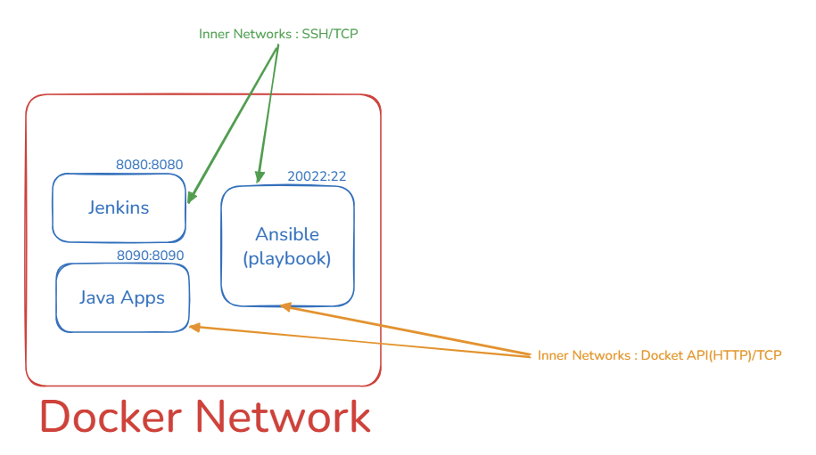

## 1.  개요

- Java ver 21.
- Spring Boot ver 3.5.0 

## 2. Projects

- Jenkins cicd pipleline 구축을 위한 프로젝트
  - todeploy

## 3. pipeline


- Ansibe 컨테이너는 CD의 역할을 하며, 어디에 배포할지 결정하고 명령을 내리는 컨트롤 타워의 역할을 한다.
- 명령을 전달하여 그 결과를 수집하는 관리자의 역할.

```ssh
ssh root@server
```

```ssh
/usr/sbin/sshd
```

| 구성 요소       | Host Port | Container(Inner) Port | 설명                       |
|-------------|-----------|-----------------------|--------------------------|
| Jenkins     | 8080      | 8080                  | CI/CD 서버                 |
| Tomcat      | 8081      | 8080                  | WAS (외부 8081 → 내부 8080)  |
| Ansible     | 8082      | 8080                  | Docker Network에서 SCP/SSH |
| Application | 8090      | 8090                     | Spring Boot 등 애플리케이션     |

```scss
1. Git push
2. Jenkins가 코드 빌드 및 Registry push, ansible 실행
```

```
Jenkins
- build (jar)
- docker build
- docker push
```

```scss
3. Ansible playbook이 SSH를 통해 배포 대상 서버에 접속해서 registry로부터 image pull, 반영(docker compose)
4. playbook을 기반으로 배포 대상 서버는 docker image pull, compose restart하여 재실행, 반영
```

> 내부적으로 Jenkins가 Ansible-playbook을 통해 Ansible 실행, 이후 Ansible이 docker image build 등을 통해 무중단 배포 및 반여.
- jar는 /workspace/project/build/libs/app.jar에 존재하며
- Ansible을 실행할때 그 경로를 넘기고, Docker image build/deploy 
  - 현재 docker compose 실행 체계는 내 컴퓨터이기에, Ansible이 SSH 실행하지 않고 바로 pull, restart한다.

> KEY POINTS
- 최종 실행 주체는 host OS(내컴퓨터 그 자체가 pull받은 도커이미지를 실행하는 방식)
- ansible의 control 주체는 결국 컨테이너가 아닌 서버 그 자체이다.

※ 참고 : Http vs SSH(TCP기반 응용계층이자 Client/Server(sshd)간 통신을 위한 프로그램)

| 구분 | HTTP      | SSH          |
| -- | --------- | ------------ |
| 목적 | 데이터 요청/응답 | 원격 명령 실행     |
| 서버 | 웹 서버      | SSH 서버(sshd) |
| 결과 | HTML/JSON | 쉘 실행 결과      |
| 상태 | Stateless | 세션 유지        |
