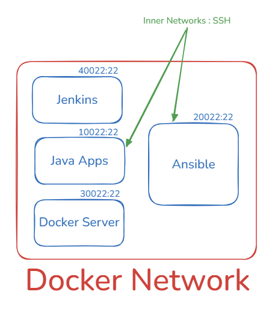

## 1.  개요

- Java ver 21.
- Spring Boot ver 3.5.0 

## 2. Projects

- Jenkins cicd pipleline 구축을 위한 프로젝트
  - todeploy

## 3. pipeline


- Ansibe 컨테이너는 CD의 역할을 하며, 어디에 배포할지 결정하고 명령을 내리는 컨트롤 타워의 역할을 한다.
- 명령을 전달하여 그 결과를 수집하는 관리자의 역할.

```ssh
ssh root@server
```

```ssh
/usr/sbin/sshd
```

| 구성 요소       | Host Port | Container(Inner) Port | 설명                      |
|-------------|-----------| --------------------- | ----------------------- |
| Jenkins     | 8080      | 8080                  | CI/CD 서버                |
| Tomcat      | 8081      | 8080                  | WAS (외부 8081 → 내부 8080) |
| Ansible     | 8082      | 8080                  |  |
| Application | 8090      | (내부 실행 포트)            | Spring Boot 등 애플리케이션    |

```scss
1. 개발자가 Git push
2. Jenkins가 코드 빌드
3. Jenkins가 Ansible 실행
4. Ansible이 Java 서버에 접속 (SSH)
5. Java 서버에 배포
```

※ 참고 : Http vs SSH(TCP기반 응용계층이자 Client/Server(sshd)간 통신을 위한 프로그램)

| 구분 | HTTP      | SSH          |
| -- | --------- | ------------ |
| 목적 | 데이터 요청/응답 | 원격 명령 실행     |
| 서버 | 웹 서버      | SSH 서버(sshd) |
| 결과 | HTML/JSON | 쉘 실행 결과      |
| 상태 | Stateless | 세션 유지        |
